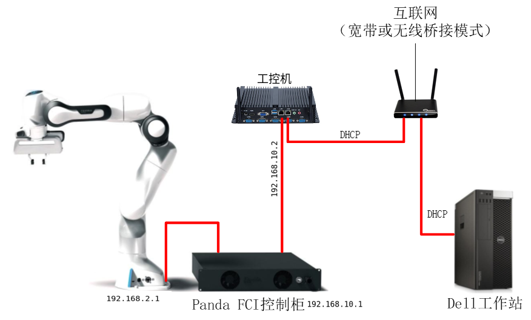
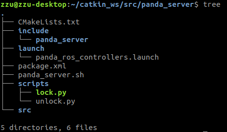
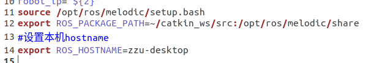
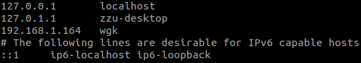
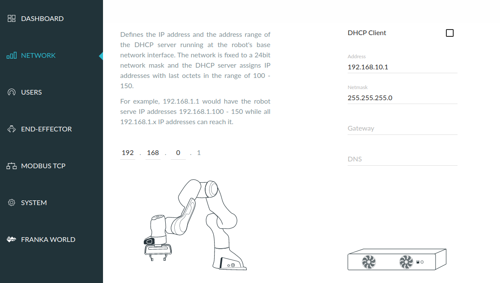
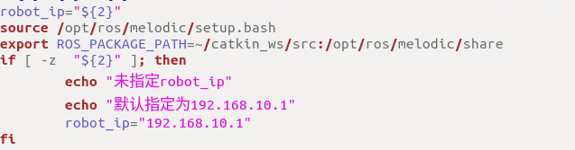

# panda_server
本包主要用于ROS框架下，科研版panda实体机械臂的配置使用，本包安装于工控机端，直连panda的控制柜；

## 介绍

​	由于Panda机械臂要求使用实时操作系统来保证控制的实时性，因此需要给Ubuntu系统的linux内核打上实时补丁，但是由于NVIDIA的显卡驱动不支持Linux实时内核，使得显卡无法支持双显示屏以及更改分辨率，并且使得以后可能用到的cuda等任务无法实现；因此，考虑利用ROS的分布式特性，使用两台电脑分别当作主从机来实现这一功能，具体的：
​    主从机分别是工作站和一台工控机（与机器人通过网线直连）；在这里将工作站当作从机，将工控机当作主机。两者的分工分别是：在工控机上运行实时liunx内核的Ubuntu系统，执行机械臂底层运动相关任务；在工作站上运行视觉检测，规划抓取等上层任务。



## 主要文件

为了方便以后的拓展，将所有的文件都放在了一个名为`panda_server`的ROS程序包中了，文件结构为：



- `lock.py`和`unlock.py`                     使用`https`协议对panda机械臂进行加&解锁；
- `panda_ros_controllers.launch`     启动工控机端的panda底层`controllers`，准备接收工作站端规划出的轨迹并执行；
- `panda_server.sh`                           一个bash脚本，工作站通过ssh来运行该文件，调用上面的三个文件/指令，来实现对机械臂加解锁、启动/重启`ros controller`


## 安装

这里只介绍工控机端的配置步骤，关于工作站端的配置步骤，参见https://github.com/Hymwgk/panda_moveit_config；

1. 确保已经为工控机安装了Ubuntu实时内核并启动；

2. 确保工控机已经安装了ssh，并实现了与工作站之间的免密码ssh连接；

3. 按照图1对系统进行物理连接，确保同处于一个局域网；

4. 确保已经安装了ROS（我们使用了ROS melodic&Ubuntu18.04LTS）

5. 在命令窗口中，执行`ifconfig`和`hostname`命令，得到工控机网络局域网地址以及本机hostname，修改`panda_server.sh`中14行

   

6. 打开`.bashrc`文件，末尾添加

   ```
   export ROS_HOSTNAME=工控机hostname
   ```

   

7. **在工作站端**，执行`ifconfig`和`hostname`命令，得到工作站网络局域网地址(假设为`192.168.1.164`)工作站hostname(假设为`wgk`)；返回**工控机端**执行命令

   ```
   sudo gedit /etc/hosts
   ```

   将工作站的局域网ip以及hostname填写到工控机hosts文件中（如下图第三行）

   

5. 在已创建的ROS工作空间中执行：

   ```bash
   cd ~/catkin_ws/src
   git clone https://github.com/Hymwgk/panda_server.git
   cd ..
   catkin build
   ```

6. 在工控机浏览器地址输入"robot.franka.de" 登录，并根据局域网的路由地址，设置右侧的地址，确保左右两侧的第三网段不相同（如果已经配置好，只需记录下右侧的ip地址）

   

7. 修改panda_server.sh文件中的"robot_ip"，使其等于上图右侧的ip地址；

   

8. 查看并记录本工控机的局域网ip地址（使用ifconfig命令查看地址），以及当前账户名称。

9. 进行下一步工作站端的[配置步骤](https://github.com/Hymwgk/panda_moveit_config) 。 
   
   
   
   