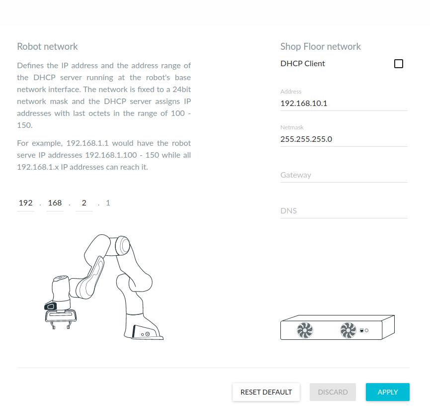
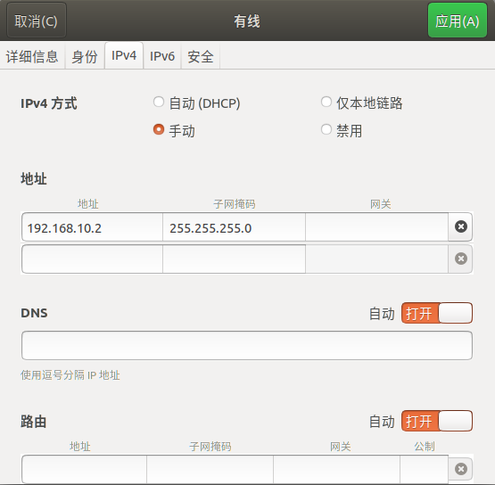

## panda机械臂网络设置

如果连接FCI控制柜，出厂设置右侧的`DHCP`选项是打开的，此时，工控机直接用网线连接控制柜，在浏览器中直接输入`robot.franka.de`就可以打开设置界面；

如果已右侧手动设置了IP地址和网关，就需要手动设置工控机网络适配器的IP和网关；如果忘记了这些值，就需要使用网线连接工控机和机械臂基座的`x5`端口，此时在浏览器中直接输入`robot.franka.de`也可以直接打开界面，查看已经设置好的IP地址和。

右侧的ip地址，指定的是控制柜本体的ip，如果右侧设置了固定ip，已上图为例，那么工控机ip不可以使用DHCP模式，工控机的ip可以设置为如下值，之后在浏览器中输入地址`192.168.10.1`即可登录界面

